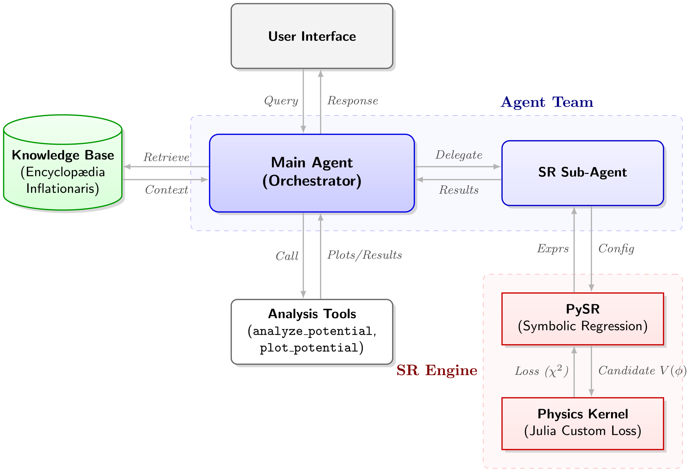

# DeepInflation

DeepInflation is an AI Agent for Inflationary Cosmology Research and Model Discovery, built on [Agno](https://github.com/agno-agi/agno).

The agent integrates symbolic regression ([PySR](https://github.com/MilesCranmer/PySR)) to discover inflationary potentials from observational constraints and a RAG knowledge base derived from [Encyclopædia Inflationaris](https://arxiv.org/abs/1303.3787) for theoretical background.



## Setup

### 1. Python

Requires Python 3.10+.

```bash
# uv (recommended)
uv sync

# or pip
pip install -r requirements.txt
```

### 2. Julia

Symbolic regression requires Julia. Install from <https://julialang.org/downloads/>.

```bash
# Initialize Julia packages (~3-5 min first time)
python setup_julia.py
```

### 3. Run

```bash
python app.py  # → http://127.0.0.1:7860
```

## API Configuration

Configure in web UI or via environment variables. UI settings take priority.

**OpenAI:**

```bash
export OPENAI_API_KEY="sk-..."
```

**Custom provider** (OpenAI-compatible API):

```bash
export OPENAI_API_KEY="your-key"
export BASE_URL="https://api.your-provider.com/v1"
```

**Ollama** (local):

```bash
export BASE_URL="http://localhost:11434/v1"
# Then set model in UI
```

## Usage

### Web Interface

Natural language queries via the chat interface:

| Query                                       | Tool                        |
| ------------------------------------------- | --------------------------- |
| "What is ns for V = phi^2?"                 | `analyze_potential`         |
| "Find potentials with ns ≈ 0.965, r < 0.01" | `search_potential` (SR)     |
| "What is Starobinsky inflation?"            | `search_encyclopedia` (RAG) |

### Python API

```python
from deepinflation.agent import DeepInflation

agent = DeepInflation(model="gpt-5.2")
response = agent.run("What is ns for V = phi^2?")
```

## License

- Code: MIT License.
- RAG Data: The documents under `data/models/` is derived from [Encyclopædia Inflationaris](https://arxiv.org/abs/1303.3787) and licensed under CC BY-NC-SA 4.0 (see `data/models/LICENSE` and `ATTRIBUTION.md`).
