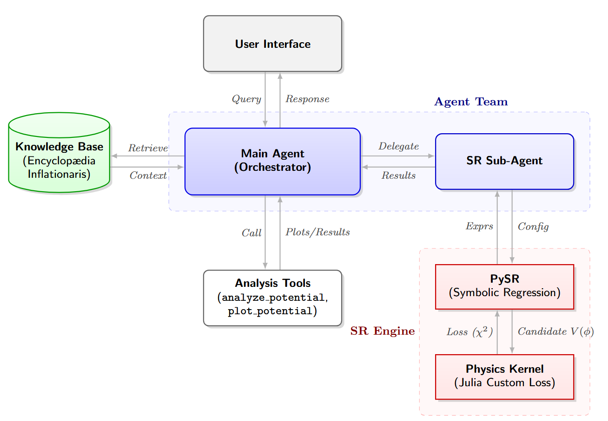
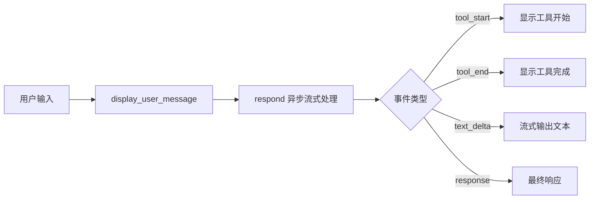
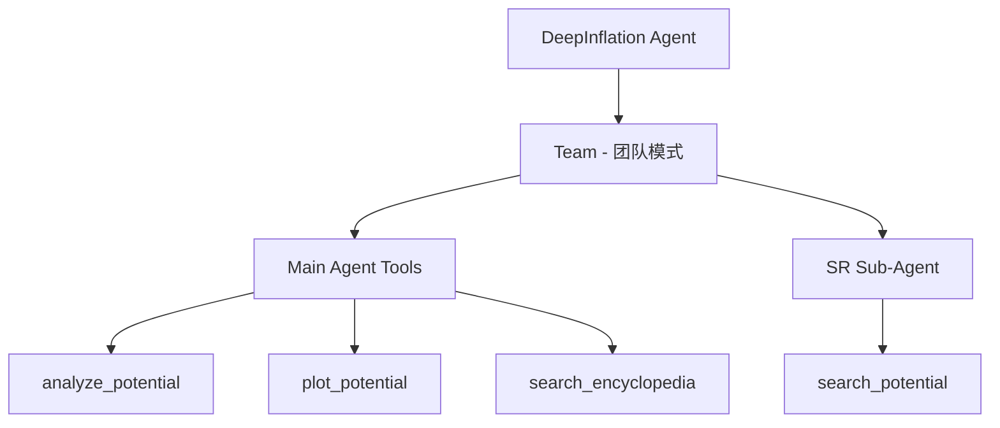
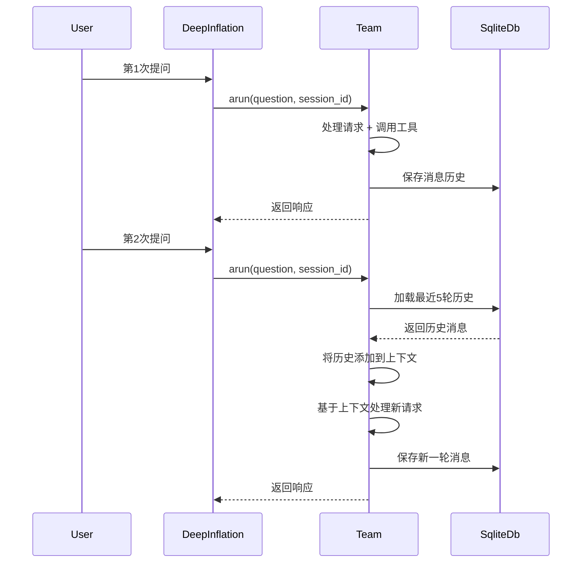
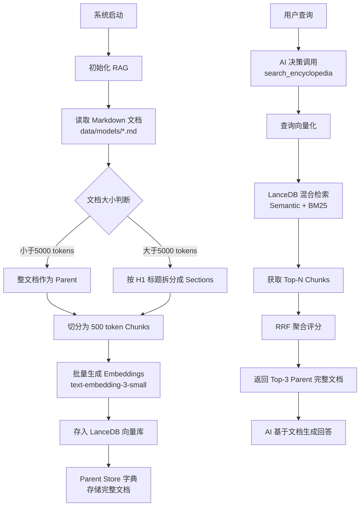
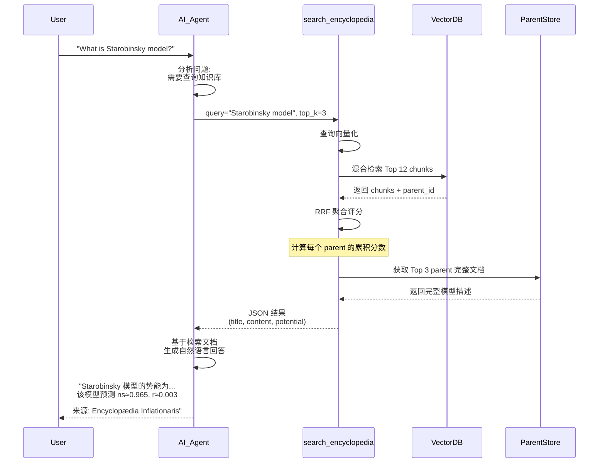
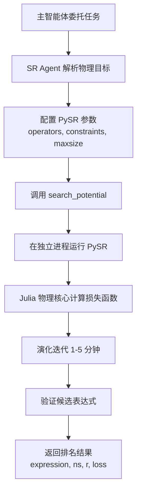
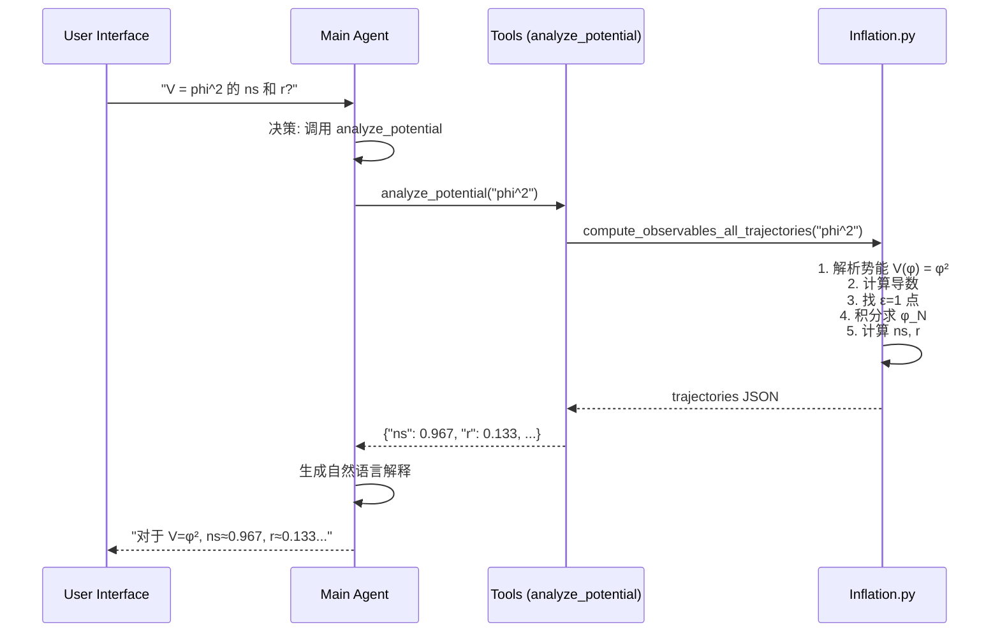
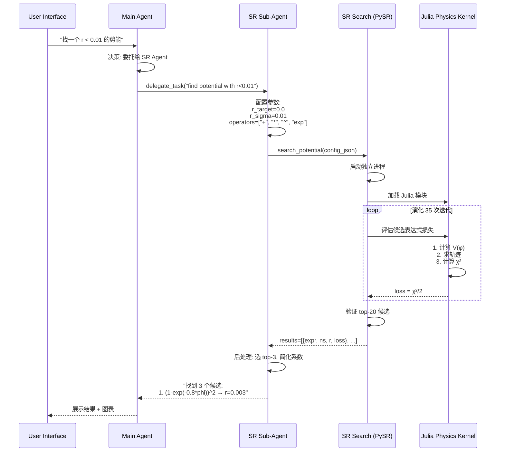

# DeepInflation 代码结构详解



## 一、系统架构概览

DeepInflation 是一个基于多智能体协作的宇宙学势能分析系统,用于研究暴胀宇宙学模型。根据架构图,整个系统分为以下几个核心组件:

### 核心组件映射

| 架构图组件 | 代码实现 | 主要文件 |
|-----------|---------|---------|
| **User Interface** | Gradio Web界面 | [app.py](file:///home/phan635/HybridAutomata/baseline_ha/DeepInflation-pq/app.py) |
| **Main Agent (Orchestrator)** | 主编排智能体 | [agent.py](file:///home/phan635/HybridAutomata/baseline_ha/DeepInflation-pq/deepinflation/agent.py) |
| **Knowledge Base** | RAG向量数据库 | [encyclopedia_rag.py](file:///home/phan635/HybridAutomata/baseline_ha/DeepInflation-pq/deepinflation/encyclopedia_rag.py) |
| **SR Sub-Agent** | 符号回归子智能体 | [agent.py](file:///home/phan635/HybridAutomata/baseline_ha/DeepInflation-pq/deepinflation/agent.py#L321-L331) |
| **Analysis Tools** | 势能分析工具 | [tools.py](file:///home/phan635/HybridAutomata/baseline_ha/DeepInflation-pq/deepinflation/tools.py) |
| **PySR** | 符号回归引擎 | [sr_search.py](file:///home/phan635/HybridAutomata/baseline_ha/DeepInflation-pq/deepinflation/sr_search.py) |
| **Physics Kernel** | Julia物理计算核心 | [sr_search.py](file:///home/phan635/HybridAutomata/baseline_ha/DeepInflation-pq/deepinflation/sr_search.py#L25-L208) |

---

## 二、各模块详细讲解

### 📱 1. User Interface (app.py)

**功能**: 提供基于 Gradio 的 Web 交互界面,支持流式对话和工具状态显示。

#### 核心流程



#### 关键函数

- **`initialize_agent`** ([app.py:L23-L52](file:///home/phan635/HybridAutomata/baseline_ha/DeepInflation-pq/app.py#L23-L52)): 初始化 DeepInflation 智能体
  ```python
  agent = DeepInflation(
      api_key=api_key,
      base_url=base_url,
      model=model,
      embedding_model=embedding_model,
      verbose=False
  )
  ```

- **`respond`** ([app.py:L79-L191](file:///home/phan635/HybridAutomata/baseline_ha/DeepInflation-pq/app.py#L79-L191)): 异步流式响应处理器
  - 监听 `agent.stream()` 生成的事件流
  - 处理工具调用状态 (`tool_start`, `tool_end`)
  - 实时更新 UI 显示

---

### 🧠 2. Main Agent - 主编排智能体 (agent.py)

**功能**: 系统的核心控制器,负责协调所有工具和子智能体,采用 **ReAct** (Reasoning + Acting) 模式。

#### 架构设计



#### 核心类与方法

**DeepInflation 类** ([agent.py:L265-L481](file:///home/phan635/HybridAutomata/baseline_ha/DeepInflation-pq/deepinflation/agent.py#L265-L481))

```python
class DeepInflation:
    def __init__(self, api_key, base_url, model, embedding_model, temperature, verbose):
        # 1. 初始化 OpenAI 模型
        self._model = OpenAILike(id=model, api_key=api_key, ...)
        
        # 2. 初始化知识库 RAG
        init_rag(api_key=api_key, embedding_model=embedding_model)
        
        # 3. 创建智能体团队
        self.team = self._create_team()
```

**团队创建** ([agent.py:L320-L343](file:///home/phan635/HybridAutomata/baseline_ha/DeepInflation-pq/deepinflation/agent.py#L320-L343))

```python
def _create_team(self):
    # 创建 SR 子智能体
    sr_agent = Agent(
        name="SR Agent",
        instructions=SR_AGENT_PROMPT,  # 符号回归专家提示词
        tools=[search_potential]       # 唯一工具: 符号回归搜索
    )
    
    # 创建主团队
    return Team(
        name="Inflation Research Team",
        members=[sr_agent],           # 包含 SR 子智能体
        tools=[analyze_potential, plot_potential, search_encyclopedia],
        instructions=MAIN_AGENT_PROMPT  # 主智能体提示词
    )
```

#### 决策树 (来自 Prompt)

主智能体根据用户请求自动选择合适的工具或委托子智能体:

```
用户请求
├─ "V = ... 的 ns/r 是多少?" → analyze_potential
├─ "绘制势能图 V = ..." → plot_potential
├─ "什么是 [模型名]?" → search_encyclopedia
└─ "找一个满足 ns≈... 的势能" → 委托给 SR Sub-Agent
```

#### 流式输出机制

**`stream` 方法** ([agent.py:L345-L461](file:///home/phan635/HybridAutomata/baseline_ha/DeepInflation-pq/deepinflation/agent.py#L345-L461))

```python
async def stream(self, question: str):
    """异步生成事件流供 Gradio 消费"""
    async for event in self.team.arun(input=question, stream=True, stream_events=True):
        # 检测工具调用开始
        if event.event == TeamRunEvent.tool_call_started:
            yield {"type": "tool_start", "call_id": ..., "info": ..., "args": ...}
        
        # 检测工具调用完成
        elif event.event == TeamRunEvent.tool_call_completed:
            yield {"type": "tool_end", "call_id": ..., "duration": ...}
        
        # 流式文本输出
        elif event.event == TeamRunEvent.run_content:
            yield {"type": "text_delta", "delta": event.content}
```

---

### 📚 3. Database - 对话历史管理 (SqliteDb)

**功能**: 持久化存储对话历史,支持多轮对话上下文管理,由 Agno 框架的 `SqliteDb` 提供。

#### 初始化与配置

**数据库创建** ([agent.py:L307-L310](file:///home/phan635/HybridAutomata/baseline_ha/DeepInflation-pq/deepinflation/agent.py#L307-L310))

```python
self._db = SqliteDb(
    db_file="tmp/agent_storage.db",           # 数据库文件路径
    session_table="inflation_agent_sessions",  # 会话表名
)
```

**传递给 Team** ([agent.py:L340](file:///home/phan635/HybridAutomata/baseline_ha/DeepInflation-pq/deepinflation/agent.py#L340))

```python
return Team(
    name="Inflation Research Team",
    model=self._model,
    members=[sr_agent],
    tools=[analyze_potential, plot_potential, search_encyclopedia],
    instructions=MAIN_AGENT_PROMPT,
    db=self._db,                      # ← 连接数据库
    add_history_to_context=True,      # ← 启用历史记录
    num_history_runs=5,                # ← 保留最近 5 轮对话
)
```

#### 数据存储内容

数据库自动保存以下内容:

| 数据类型 | 说明 | 示例 |
|---------|------|------|
| **用户消息** | 用户的原始输入 | "What is ns for V=phi^2?" |
| **AI 回复** | 助手的完整响应 | "对于 V=φ²,标量谱指数 ns≈0.967..." |
| **工具调用** | 工具名称 + 参数 + 结果 | `analyze_potential("phi^2") → {...}` |
| **系统消息** | Prompt 指令 | MAIN_AGENT_PROMPT 内容 |
| **会话元数据** | 时间戳、session_id | `2026-02-04T17:53:30, uuid-1234...` |

#### 工作流程



#### 会话管理机制

**1. Session ID 生成** ([agent.py:L316](file:///home/phan635/HybridAutomata/baseline_ha/DeepInflation-pq/deepinflation/agent.py#L316))

```python
self.session_id = str(uuid4())  # 唯一会话标识符
```

**2. 使用 Session ID 查询** ([agent.py:L364](file:///home/phan635/HybridAutomata/baseline_ha/DeepInflation-pq/deepinflation/agent.py#L364))

```python
async for event in self.team.arun(
    input=question,
    stream=True,
    session_id=self.session_id,  # Agno 自动加载此 session 的历史
):
```

**3. 清空历史** ([agent.py:L475-L480](file:///home/phan635/HybridAutomata/baseline_ha/DeepInflation-pq/deepinflation/agent.py#L475-L480))

```python
def clear_history(self):
    """生成新 session_id,开始全新对话"""
    self.session_id = str(uuid4())  # 新会话不会加载旧历史
    self.last_plot_path = None
```

#### 实际使用示例

```python
# 场景: 多轮对话

# 第 1 轮
user: "What is V for Starobinsky model?"
ai: "The Starobinsky model has potential V = (1-exp(-√(2/3)φ))²"
# → 保存到 session_A

# 第 2 轮 (AI 能记住第 1 轮内容)
user: "Calculate ns and r for it"
ai: "For the Starobinsky model (V=(1-exp(-√(2/3)φ))²), ns≈0.965, r≈0.003"
# → 加载 session_A 历史 + 保存新对话

# 第 3 轮
user: "Plot this potential"
ai: [调用 plot_potential("(1-exp(-sqrt(2/3)*phi))^2")]
# → AI 知道 "this potential" 指的是 Starobinsky 模型

# 清空历史
agent.clear_history()

# 第 4 轮 (新会话)
user: "Plot this potential"
ai: "Which potential do you want to plot?"  # 不记得之前的对话
```

#### 数据库 vs RAG 对比

| 特性 | **Database (对话历史)** | **RAG (知识库)** |
|------|----------------------|----------------|
| **数据来源** | 当前用户的实时对话 | 预先准备的专业文档 |
| **存储位置** | `tmp/agent_storage.db` | `tmp/lancedb/` |
| **加载方式** | 按 `session_id` 自动加载 | 主动调用工具检索 |
| **更新频率** | 每次对话实时更新 | 知识库静态,启动时加载 |
| **作用** | 记住用户对话上下文 | 提供专业物理知识 |
| **生命周期** | 会话持久化,可跨重启 | 持久化,直到重建索引 |

---

### 📚 4. Knowledge Base - 知识库 (encyclopedia_rag.py)

**功能**: 基于 **Parent Document Retrieval** 的 RAG (检索增强生成) 系统,存储 70+ 暴胀宇宙学模型文档,提供专业知识检索能力。

#### RAG 系统架构



#### 核心类与初始化

**EncyclopediaRAG 类** ([encyclopedia_rag.py:L42-L90](file:///home/phan635/HybridAutomata/baseline_ha/DeepInflation-pq/deepinflation/encyclopedia_rag.py#L42-L90))

```python
class EncyclopediaRAG:
    def __init__(self, api_key, base_url, embedding_model="text-embedding-3-small"):
        # 1. 初始化 OpenAI Embedder
        self.embedder = OpenAIEmbedder(
            id=embedding_model,
            api_key=api_key,
            base_url=base_url,
            enable_batch=True,      # 批量处理加速
            batch_size=300
        )
        
        # 2. 初始化向量数据库 (LanceDB)
        self.vector_db = LanceDb(
            uri="tmp/lancedb",
            table_name="encyclopedia_chunks",
            search_type=SearchType.hybrid  # 混合检索: 语义 + 关键词
        )
        
        # 3. 父文档存储 (内存字典)
        self.parent_store = {}  # parent_id -> {title, content, metadata}
        
        # 4. 构建或加载索引
        if not self._index_exists():
            self._build_index()
```

#### 索引构建流程

**文档切分策略** ([encyclopedia_rag.py:L92-L141](file:///home/phan635/HybridAutomata/baseline_ha/DeepInflation-pq/deepinflation/encyclopedia_rag.py#L92-L141))

```python
def _build_index(self):
    for md_file in Path(MODELS_DIR).glob("*.md"):
        content = md_file.read_text()
        model_name = md_file.stem
        
        # 根据大小决定切分策略
        if _tokens(content) <= 5000:
            # 小文档: 整个作为一个 Parent
            parents = [(model_name, content)]
        else:
            # 大文档: 按 H1 标题拆分成多个 Section Parents
            parents = self._split_by_sections(content, model_name)
        
        # 处理每个 Parent
        for title, text in parents:
            parent_id = md5(title.encode()).hexdigest()[:16]
            
            # 存储完整 Parent 文档
            self.parent_store[parent_id] = {
                "title": title,
                "content": text,  # 完整内容,用于返回
                "metadata": {...},
                "model": model_name
            }
            
            # 将 Parent 切分成小 Chunks 用于检索
            for chunk in self._chunk_by_paragraphs(text):
                all_chunks.append((chunk, parent_id))
    
    # 批量 Embedding
    embeddings = self.embedder.async_get_embeddings_batch(chunks)
    
    # 插入向量库
    self.vector_db.table.add(data)
```

**为什么用 Parent-Chunk 策略?**

| 方面 | 优势 |
|------|------|
| **检索精度** | 小 Chunks (500 tokens) 提高语义匹配精度 |
| **上下文完整性** | 返回完整 Parent 文档,避免信息碎片化 |
| **效率** | 只需对 Chunks 向量化,Parent 直接存储 |

#### 检索算法: Reciprocal Rank Fusion (RRF)

**`search` 方法** ([encyclopedia_rag.py:L255-L275](file:///home/phan635/HybridAutomata/baseline_ha/DeepInflation-pq/deepinflation/encyclopedia_rag.py#L255-L275))

```python
def search(self, query: str, num_chunks=10, num_parents=3):
    """
    三步检索流程:
    1. 向量检索 top-N chunks
    2. RRF 算法聚合 parent 分数
    3. 返回 top-K parent 完整文档
    """
    # Step 1: 混合检索 (语义 + BM25)
    chunk_results = self.vector_db.search(query, limit=num_chunks)
    
    # Step 2: RRF 评分聚合
    scores = {}
    for rank, doc in enumerate(chunk_results):
        parent_id = doc.meta_data["parent_id"]
        # RRF 公式: score += 1/(k + rank), k=1
        scores[parent_id] = scores.get(parent_id, 0) + 1.0 / (rank + 2)
    
    # Step 3: 返回得分最高的 parent 完整文档
    ranked_parents = sorted(scores.keys(), key=lambda p: scores[p], reverse=True)
    return [
        {**self.parent_store[pid], "score": scores[pid]} 
        for pid in ranked_parents[:num_parents]
    ]
```

**RRF 算法示例**:

```
假设检索到 10 个 chunks:
Chunk 1 (rank=0) → Parent A: score += 1/(0+2) = 0.500
Chunk 2 (rank=1) → Parent B: score += 1/(1+2) = 0.333
Chunk 3 (rank=2) → Parent A: score += 1/(2+2) = 0.250  (累加!)
Chunk 4 (rank=3) → Parent C: score += 1/(3+2) = 0.200
...

最终分数:
Parent A: 0.500 + 0.250 = 0.750 (排名第1,多个 chunks 命中)
Parent B: 0.333 (排名第2)
Parent C: 0.200 (排名第3)

返回: [Parent A 完整文档, Parent B 完整文档, Parent C 完整文档]
```

**RRF 的优势**: 如果一个父文档有多个 chunks 被匹配,它会积累更高分数,更有可能被选中。

#### 作为工具集成到 Agent

**工具注册** ([agent.py:L336](file:///home/phan635/HybridAutomata/baseline_ha/DeepInflation-pq/deepinflation/agent.py#L336))

```python
Team(
    tools=[analyze_potential, plot_potential, search_encyclopedia],
    # search_encyclopedia 是 RAG 工具的对外接口
)
```

**工具函数** ([encyclopedia_rag.py:L296-L344](file:///home/phan635/HybridAutomata/baseline_ha/DeepInflation-pq/deepinflation/encyclopedia_rag.py#L296-L344))

```python
def search_encyclopedia(query: str, top_k: int = 3) -> str:
    """
    AI 调用此工具查询知识库
    
    Args:
        query: 自然语言查询 (例如: "Starobinsky model")
        top_k: 返回文档数量 (默认 3, 最大 5)
    
    Returns:
        JSON 格式结果:
        {
            "success": True,
            "count": 3,
            "results": [
                {
                    "title": "Starobinsky Model",
                    "content": "完整模型文档...",
                    "potential_latex": "$V = (1-e^{-\\sqrt{2/3}\\phi})^2$",
                    "parameters": "..."
                },
                ...
            ]
        }
    """
    results = _rag.search(query, num_chunks=4*top_k, num_parents=top_k)
    return json.dumps({"success": True, "results": results})
```

#### 完整使用流程



#### RAG 初始化时机

**系统启动时初始化** ([agent.py:L300-L305](file:///home/phan635/HybridAutomata/baseline_ha/DeepInflation-pq/deepinflation/agent.py#L300-L305))

```python
class DeepInflation:
    def __init__(self, ...):
        # 在创建 Agent 前初始化 RAG (单例模式)
        init_rag(
            api_key=self._api_key,
            base_url=self._base_url,
            embedding_model=embedding_model
        )
        # RAG 初始化后,所有 Agent 都可以使用 search_encyclopedia 工具
```

#### 知识库内容

| 类别 | 内容 | 来源 |
|------|------|------|
| **模型文档** | 70+ 个 Markdown 文件 | `data/models/*.md` |
| **元数据** | 势能表达式、参数 | `data/model_list.json` |
| **文献来源** | Encyclopædia Inflationaris | [arXiv:1303.3787](https://arxiv.org/abs/1303.3787) |

**知识库示例文档结构**:

```markdown
# Starobinsky Model

The Starobinsky model is one of the earliest and most successful...

## Potential
$V(\phi) = (1 - e^{-\sqrt{2/3}\phi})^2$

## Predictions
- Spectral index: $n_s \approx 0.965$
- Tensor-to-scalar ratio: $r \approx 0.003$

## Theoretical Background
This model arises from $R^2$ gravity...
```

---

### 🔬 4. Analysis Tools - 分析工具 (tools.py)

**功能**: 提供两个核心物理计算工具,基于 [inflation.py](file:///home/phan635/HybridAutomata/baseline_ha/DeepInflation-pq/deepinflation/inflation.py) 的计算引擎。

#### 工具 1: `analyze_potential` (计算观测量)

**输入**: 势能表达式 `V(φ)`,例如 `phi^2` 或 `(1-exp(-0.816*phi))^2`  
**输出**: JSON 格式的所有有效轨迹的观测量 `(ns, r, A_s)`

**调用链**:
```
analyze_potential(expression)
  ↓
compute_observables_all_trajectories(expression)  # inflation.py
  ↓
compute_observables(V, V', V'', phi_min, phi_max)
  ↓
[找到 ε=1 的 phi_end → 积分求 phi_N → 计算 ns, r, A_s]
```

**关键物理量计算** ([inflation.py:L68-L81](file:///home/phan635/HybridAutomata/baseline_ha/DeepInflation-pq/deepinflation/inflation.py#L68-L81)):

```python
# 慢滚参数 ε = (M_P²/2)(V'/V)²
def epsilon(V, V_prime, phi):
    return (M_P2 / 2) * (V_prime(phi) / V(phi))**2

# 观测量计算
ns = 1.0 - 6.0*ε_N + 2.0*η_N  # 标量谱指数
r = 16.0 * ε_N                # 张标比
A_s = V(phi_N) / (24*π²*M_P²²*ε_N)  # 功率谱幅度
```

#### 工具 2: `plot_potential` (生成诊断图)

**输入**: 势能表达式 + 输出路径  
**输出**: 3 面板诊断图 PNG 文件

**三个面板内容**:
1. **Panel 1**: V(φ) 曲线 + 轨迹标记点 (φ_end, N=50, N=60)
2. **Panel 2**: 慢滚参数 ε(φ), η(φ) 的对数图
3. **Panel 3**: (ns, r) 平面上的预测值 vs Planck+BK18 观测后验

**绘图代码示例** ([tools.py:L106-L194](file:///home/phan635/HybridAutomata/baseline_ha/DeepInflation-pq/deepinflation/tools.py#L106-L194)):

```python
# Panel 1: 势能曲线
axes[0].plot(phi_plot, V_plot, linewidth=2, color="#2E86AB")

# 标记轨迹端点 (ε=1)
for i, t60 in enumerate(trajectories_60):
    axes[0].scatter(t60["phi_end"], get_V(t60["phi_end"]), marker="x")
    axes[0].scatter(t60["phi_N"], get_V(t60["phi_N"]), marker="o")  # N=60

# Panel 3: ns-r 平面叠加 Planck 后验
axes[2].contourf(ns, r, P_bk18, levels=[level_68, level_95])  # 置信区间
axes[2].scatter(t60["ns"], t60["r"], ...)  # 模型预测
```

---

### 🧬 5. SR Sub-Agent - 符号回归子智能体

**功能**: 配置并运行 PySR 符号回归搜索,自动发现满足观测约束的势能表达式。

#### 工作流程



#### Prompt 设计要点 ([agent.py:L91-L207](file:///home/phan635/HybridAutomata/baseline_ha/DeepInflation-pq/deepinflation/agent.py#L91-L207))

**配置原则**:
1. **算符选择**: 总是包含 `["+", "*"]`,根据需要添加 `["^", "exp", "log"]`
2. **约束机制**:
   - `constraints`: 限制算符参数复杂度,如 `{"^": [-1, 1]}` 只允许常数指数
   - `nested_constraints`: 禁止嵌套,如 `{"exp": {"exp": 0}}` 防止 `exp(exp(x))`
3. **复杂度控制**: `maxsize` 限制表达式树大小 (典型 12-30)

**示例配置**:
```json
{
  "binary_operators": ["+", "*", "^"],
  "unary_operators": ["exp"],
  "constraints": {"^": [-1, 1]},
  "nested_constraints": {"exp": {"exp": 0}},
  "maxsize": 15,
  "niterations": 35
}
```

---

### 🔥 6. SR Engine - 符号回归引擎 (sr_search.py)

**功能**: PySR 工具函数 + Julia 物理计算核心。

#### 关键设计: 进程隔离

**为什么需要进程隔离?** ([sr_search.py:L396-L407](file:///home/phan635/HybridAutomata/baseline_ha/DeepInflation-pq/deepinflation/sr_search.py#L396-L407))

```python
# 使用 spawn 上下文 + max_tasks_per_child=1
# 确保每次 PySR 运行在全新进程中,避免 Julia 线程冲突
ctx = mp.get_context("spawn")
with ProcessPoolExecutor(max_workers=1, max_tasks_per_child=1, mp_context=ctx) as executor:
    result = executor.submit(_run_pysr, config).result(timeout=660)
```

#### Julia 物理核心 ([sr_search.py:L25-L208](file:///home/phan635/HybridAutomata/baseline_ha/DeepInflation-pq/deepinflation/sr_search.py#L25-L208))

**嵌入式 Julia 模块**,直接编译到 PySR 进程中:

```julia
# 计算慢滚参数 ε
function epsilon(V, V_prime, phi, phi_min, phi_max)
    V_val, V_p = V(phi), V_prime(phi)
    return (M_P2 / 2) * (V_p / V_val)^2
end

# 通过 ODE 积分求 φ_N
function find_phi_N(V, V_prime, phi_end, bound)
    dphi_dN!(dphi, phi, p, N) = dphi[1] = M_P2 * V_prime(phi[1]) / V(phi[1])
    prob = ODEProblem(dphi_dN!, [phi_end], (0.0, N_OBS))
    sol = solve(prob; reltol=1e-4)
    return sol.u[end][1]  # 返回 N 个 e-folds 处的 φ 值
end

# PySR 损失函数: χ²/2
function compute_loss_julia(tree, dataset, options)
    # 1. 计算表达式预测值
    prediction = eval_tree_array(tree, dataset.X, options)
    
    # 2. 插值构建势能函数 V(φ)
    itp = cubic_spline_interpolation(phis, prediction)
    V(phi) = itp(phi)
    V_prime(phi) = Interpolations.gradient(itp, phi)[1]
    
    # 3. 计算所有有效轨迹的 (ns, r)
    obs_list = compute_observables(V, V_prime, V_double_prime, phi_min, phi_max)
    
    # 4. 计算最小 χ²
    chi2_min = min( ((ns - NS_OBS)/NS_SIGMA)^2 + ((r - R_OBS)/R_SIGMA)^2 )
    
    return chi2_min / 2
end
```

**损失函数设计亮点**:
1. **自动轨迹搜索**: 不需要手动指定初始条件,自动找到所有 ε=1 的端点
2. **多轨迹处理**: 取所有有效轨迹中 χ² 最小的
3. **数值稳定性检查**: 如果 χ² < 3,额外在粗网格上验证防止过拟合

---

### ⚙️ 7. Physics Kernel - 物理计算引擎 (inflation.py)

**功能**: Python 实现的暴胀宇宙学核心计算库,与 Julia 版本逻辑一致。

#### 核心函数调用链

```
compute_observables_all_trajectories(expression)
  ├─ parse_potential(expression) → V(φ)
  ├─ numerical_derivative → V'(φ), V''(φ)
  └─ compute_observables(V, V', V'', phi_min, phi_max)
      ├─ 找到所有 ε=1 的点 (通过 brentq 求根)
      ├─ 对每个 phi_end:
      │   ├─ find_phi_N(N_values) → 求 phi_N
      │   └─ 计算观测量 ns, r, A_s
      └─ 返回所有有效轨迹
```

#### 关键物理计算

**1. 找轨迹端点** ([inflation.py:L122-L136](file:///home/phan635/HybridAutomata/baseline_ha/DeepInflation-pq/deepinflation/inflation.py#L122-L136))

```python
# 在 φ ∈ [phi_min, phi_max] 寻找 ε(φ) = 1 的点
grid = np.linspace(phi_min, phi_max, 200)
eps_grid = [epsilon(V, V_prime, phi) for phi in grid]
sign_changes = np.where(np.diff(np.sign(eps_grid - 1.0)) != 0)[0]

# 对每个符号变化点用二分法精确求根
for i in sign_changes:
    phi_end = brentq(lambda phi: epsilon(V, V_prime, phi) - 1.0, grid[i], grid[i+1])
```

**2. 积分求 φ_N** ([inflation.py:L84-L114](file:///home/phan635/HybridAutomata/baseline_ha/DeepInflation-pq/deepinflation/inflation.py#L84-L114))

```python
def find_phi_N(V, V_prime, N_values, phi_end, bound):
    """
    求解 ODE: dφ/dN = M_P² V'/V
    从 φ_end 积分到 N ∈ [50, 55, 60]
    """
    def dphi_dN(phi):
        return M_P2 * V_prime(phi[0]) / V(phi[0])
    
    sol = solve_ivp(
        lambda N, phi: dphi_dN(phi),
        [0.0, max(N_values)],
        [phi_end],
        dense_output=True
    )
    
    # 返回字典 {50: phi_50, 55: phi_55, 60: phi_60}
    return {N: sol.sol(N)[0] for N in N_values}
```

**3. 观测量计算** ([inflation.py:L169-L189](file:///home/phan635/HybridAutomata/baseline_ha/DeepInflation-pq/deepinflation/inflation.py#L169-L189))

```python
eps_N = epsilon(V, V_prime, phi_N)
eta_N = M_P2 * V_double_prime(phi_N) / V(phi_N)

ns = 1.0 - 6.0*eps_N + 2.0*eta_N  # 标量谱指数
r = 16.0 * eps_N                  # 张标比
A_s = V(phi_N) / (24*π²*M_P²²*eps_N) * 1e9  # 功率谱幅度
```

---

## 三、系统交互流程示例

### 场景 1: 用户查询 "V = phi^2 的 ns 和 r 是多少?"



### 场景 2: 用户请求 "找一个满足 r < 0.01 的势能"



---

## 四、关键技术特点总结

### 1. 多智能体协作架构
- **主智能体**: 决策中心,根据请求分发任务
- **SR 子智能体**: 专家系统,专注符号回归配置
- **工具集**: 物理计算、绘图、知识检索

### 2. 混合计算引擎
- **Python**: 用户界面、智能体逻辑、预处理
- **Julia**: 高性能物理计算 (ODE 求解、数值积分)
- **进程隔离**: 避免 Julia/Python 多线程冲突

### 3. 知识增强 RAG
- **Parent Document Retrieval**: 精确检索 + 完整上下文
- **混合检索**: 语义相似度 + BM25 关键词
- **70+ 暴胀模型**: 来自 arXiv:1303.3787

### 4. 物理约束的符号回归
- **自定义损失函数**: χ² 基于物理观测量 (ns, r)
- **表达式约束**: 通过 `constraints` 控制搜索空间
- **自动验证**: Python 侧重新计算确保正确性

### 5. 流式用户体验
- **实时工具状态**: 显示工具调用进度
- **流式文本输出**: 减少等待感知
- **可视化反馈**: 自动生成诊断图表

---

## 五、使用示例

### 启动 Web 界面
```bash
python app.py
# 访问 http://127.0.0.1:7860
```

### CLI 模式
```bash
python -m deepinflation.agent
> What is ns for V = phi^2?
> Plot the Starobinsky model
> Find a plateau potential with r < 0.01
```

### 编程接口
```python
from deepinflation.agent import DeepInflation

agent = DeepInflation(api_key="sk-...", model="gpt-5.2")

# 同步模式
response = agent.run("Analyze V = phi^2")

# 异步流式模式
async for event in agent.stream("Find potential with ns≈0.965"):
    if event["type"] == "response":
        print(event["content"])
```

---

## 六、文件结构总览

```
DeepInflation-pq/
├── app.py                      # Gradio Web 界面
├── deepinflation/
│   ├── agent.py               # 主智能体 + SR 子智能体
│   ├── inflation.py           # Python 物理计算引擎
│   ├── tools.py               # 分析与绘图工具
│   ├── sr_search.py           # PySR + Julia 符号回归
│   └── encyclopedia_rag.py    # RAG 知识库
├── data/
│   ├── models/                # 70+ 暴胀模型 Markdown 文档
│   ├── model_list.json        # 模型元数据
│   └── bk18_planck_posterior.npz  # Planck+BK18 观测数据
└── tmp/
    ├── lancedb/               # 向量数据库
    └── agent_storage.db       # 对话历史
```

---

这个系统巧妙地结合了 **大语言模型的推理能力**、**符号回归的自动发现能力** 和 **物理计算的精确性**,为暴胀宇宙学研究提供了一个智能化的分析平台。通过多智能体协作和工具编排,用户可以用自然语言与系统交互,快速完成复杂的物理计算和模型探索任务。
