# DeepInflation 代码结构详解


## 一、系统架构概览

DeepInflation 是一个基于多智能体协作的宇宙学势能分析系统,用于研究暴胀宇宙学模型。根据架构图,整个系统分为以下几个核心组件:

### 核心组件映射

| 架构图组件 | 代码实现 | 主要文件 |
|-----------|---------|---------|
| **User Interface** | Gradio Web界面 | [app.py](file:///home/phan635/HybridAutomata/baseline_ha/DeepInflation-pq/app.py) |
| **Main Agent (Orchestrator)** | 主编排智能体 | [agent.py](file:///home/phan635/HybridAutomata/baseline_ha/DeepInflation-pq/deepinflation/agent.py) |
| **Knowledge Base** | RAG向量数据库 | [encyclopedia_rag.py](file:///home/phan635/HybridAutomata/baseline_ha/DeepInflation-pq/deepinflation/encyclopedia_rag.py) |
| **SR Sub-Agent** | 符号回归子智能体 | [agent.py](file:///home/phan635/HybridAutomata/baseline_ha/DeepInflation-pq/deepinflation/agent.py#L321-L331) |
| **Analysis Tools** | 势能分析工具 | [tools.py](file:///home/phan635/HybridAutomata/baseline_ha/DeepInflation-pq/deepinflation/tools.py) |
| **PySR** | 符号回归引擎 | [sr_search.py](file:///home/phan635/HybridAutomata/baseline_ha/DeepInflation-pq/deepinflation/sr_search.py) |
| **Physics Kernel** | Julia物理计算核心 | [sr_search.py](file:///home/phan635/HybridAutomata/baseline_ha/DeepInflation-pq/deepinflation/sr_search.py#L25-L208) |

---

## 二、各模块详细讲解

### 📱 1. User Interface (app.py)

**功能**: 提供基于 Gradio 的 Web 交互界面,支持流式对话和工具状态显示。

#### 核心流程

```mermaid
graph LR
    A[用户输入] --> B[display_user_message]
    B --> C[respond 异步流式处理]
    C --> D{事件类型}
    D -->|tool_start| E[显示工具开始]
    D -->|tool_end| F[显示工具完成]
    D -->|text_delta| G[流式输出文本]
    D -->|response| H[最终响应]
```



#### 关键函数

- **`initialize_agent`** ([app.py:L23-L52](file:///home/phan635/HybridAutomata/baseline_ha/DeepInflation-pq/app.py#L23-L52)): 初始化 DeepInflation 智能体
  ```python
  agent = DeepInflation(
      api_key=api_key,
      base_url=base_url,
      model=model,
      embedding_model=embedding_model,
      verbose=False
  )
  ```

- **`respond`** ([app.py:L79-L191](file:///home/phan635/HybridAutomata/baseline_ha/DeepInflation-pq/app.py#L79-L191)): 异步流式响应处理器
  - 监听 `agent.stream()` 生成的事件流
  - 处理工具调用状态 (`tool_start`, `tool_end`)
  - 实时更新 UI 显示

---

### 🧠 2. Main Agent - 主编排智能体 (agent.py)

**功能**: 系统的核心控制器,负责协调所有工具和子智能体,采用 **ReAct** (Reasoning + Acting) 模式。

#### 架构设计


#### 核心类与方法

**DeepInflation 类** ([agent.py:L265-L481](file:///home/phan635/HybridAutomata/baseline_ha/DeepInflation-pq/deepinflation/agent.py#L265-L481))

```python
class DeepInflation:
    def __init__(self, api_key, base_url, model, embedding_model, temperature, verbose):
        # 1. 初始化 OpenAI 模型
        self._model = OpenAILike(id=model, api_key=api_key, ...)
        
        # 2. 初始化知识库 RAG
        init_rag(api_key=api_key, embedding_model=embedding_model)
        
        # 3. 创建智能体团队
        self.team = self._create_team()
```

**团队创建** ([agent.py:L320-L343](file:///home/phan635/HybridAutomata/baseline_ha/DeepInflation-pq/deepinflation/agent.py#L320-L343))

```python
def _create_team(self):
    # 创建 SR 子智能体
    sr_agent = Agent(
        name="SR Agent",
        instructions=SR_AGENT_PROMPT,  # 符号回归专家提示词
        tools=[search_potential]       # 唯一工具: 符号回归搜索
    )
    
    # 创建主团队
    return Team(
        name="Inflation Research Team",
        members=[sr_agent],           # 包含 SR 子智能体
        tools=[analyze_potential, plot_potential, search_encyclopedia],
        instructions=MAIN_AGENT_PROMPT  # 主智能体提示词
    )
```

#### 决策树 (来自 Prompt)

主智能体根据用户请求自动选择合适的工具或委托子智能体:

```
用户请求
├─ "V = ... 的 ns/r 是多少?" → analyze_potential
├─ "绘制势能图 V = ..." → plot_potential
├─ "什么是 [模型名]?" → search_encyclopedia
└─ "找一个满足 ns≈... 的势能" → 委托给 SR Sub-Agent
```

#### 流式输出机制

**`stream` 方法** ([agent.py:L345-L461](file:///home/phan635/HybridAutomata/baseline_ha/DeepInflation-pq/deepinflation/agent.py#L345-L461))

```python
async def stream(self, question: str):
    """异步生成事件流供 Gradio 消费"""
    async for event in self.team.arun(input=question, stream=True, stream_events=True):
        # 检测工具调用开始
        if event.event == TeamRunEvent.tool_call_started:
            yield {"type": "tool_start", "call_id": ..., "info": ..., "args": ...}
        
        # 检测工具调用完成
        elif event.event == TeamRunEvent.tool_call_completed:
            yield {"type": "tool_end", "call_id": ..., "duration": ...}
        
        # 流式文本输出
        elif event.event == TeamRunEvent.run_content:
            yield {"type": "text_delta", "delta": event.content}
```

---

### 📚 3. Knowledge Base - 知识库 (encyclopedia_rag.py)

**功能**: 基于 **Parent Document Retrieval** 的 RAG 系统,存储 70+ 暴胀宇宙学模型文档。

#### 技术架构

```mermaid
graph LR
    A[Markdown 文档] --> B[分段处理]
    B --> C{文档大小}
    C -->|小于5000 tokens| D[整文档作为 Parent]
    C -->|大于5000 tokens| E[按 H1 标题分段]
    D --> F[切分为 500 token Chunks]
    E --> F
    F --> G[批量 Embedding]
    G --> H[LanceDB 向量库]
    H --> I[混合检索<br/>Semantic + BM25]
```



#### 核心类

**EncyclopediaRAG** ([encyclopedia_rag.py:L42-L275](file:///home/phan635/HybridAutomata/baseline_ha/DeepInflation-pq/deepinflation/encyclopedia_rag.py#L42-L275))

```python
class EncyclopediaRAG:
    def __init__(self, api_key, base_url, embedding_model):
        # 1. 初始化 OpenAI Embedder
        self.embedder = OpenAIEmbedder(id=embedding_model, ...)
        
        # 2. 初始化向量数据库 (LanceDB)
        self.vector_db = LanceDb(
            table_name="encyclopedia_chunks",
            search_type=SearchType.hybrid  # 混合检索: 语义 + 关键词
        )
        
        # 3. 构建或加载索引
        if not self._index_exists():
            self._build_index()
```

#### 检索策略: Reciprocal Rank Fusion (RRF)

**`search` 方法** ([encyclopedia_rag.py:L255-L275](file:///home/phan635/HybridAutomata/baseline_ha/DeepInflation-pq/deepinflation/encyclopedia_rag.py#L255-L275))

```python
def search(self, query: str, num_chunks=10, num_parents=3):
    """
    1. 检索 top-10 chunks (小文本块)
    2. 通过 RRF 算法对 parent 文档打分:
       score(parent) = Σ 1/(rank + k)  (k=1)
    3. 返回得分最高的 top-3 parent 完整文档
    """
    chunk_results = self.vector_db.search(query, limit=num_chunks)
    
    # RRF 打分
    scores = {}
    for rank, doc in enumerate(chunk_results):
        parent_id = doc.meta_data["parent_id"]
        scores[parent_id] = scores.get(parent_id, 0) + 1.0 / (rank + 2)
    
    # 返回完整 parent 文档
    return [self.parent_store[pid] for pid in sorted(scores, key=scores.get, reverse=True)[:num_parents]]
```

**为什么用 Parent Document Retrieval?**
- **检索精度**: 小 chunks 提高语义匹配精度
- **上下文完整性**: 返回完整 parent 文档,避免信息碎片化

---

### 🔬 4. Analysis Tools - 分析工具 (tools.py)

**功能**: 提供两个核心物理计算工具,基于 [inflation.py](file:///home/phan635/HybridAutomata/baseline_ha/DeepInflation-pq/deepinflation/inflation.py) 的计算引擎。

#### 工具 1: `analyze_potential` (计算观测量)

**输入**: 势能表达式 `V(φ)`,例如 `phi^2` 或 `(1-exp(-0.816*phi))^2`  
**输出**: JSON 格式的所有有效轨迹的观测量 `(ns, r, A_s)`

**调用链**:
```
analyze_potential(expression)
  ↓
compute_observables_all_trajectories(expression)  # inflation.py
  ↓
compute_observables(V, V', V'', phi_min, phi_max)
  ↓
[找到 ε=1 的 phi_end → 积分求 phi_N → 计算 ns, r, A_s]
```

**关键物理量计算** ([inflation.py:L68-L81](file:///home/phan635/HybridAutomata/baseline_ha/DeepInflation-pq/deepinflation/inflation.py#L68-L81)):

```python
# 慢滚参数 ε = (M_P²/2)(V'/V)²
def epsilon(V, V_prime, phi):
    return (M_P2 / 2) * (V_prime(phi) / V(phi))**2

# 观测量计算
ns = 1.0 - 6.0*ε_N + 2.0*η_N  # 标量谱指数
r = 16.0 * ε_N                # 张标比
A_s = V(phi_N) / (24*π²*M_P²²*ε_N)  # 功率谱幅度
```

#### 工具 2: `plot_potential` (生成诊断图)

**输入**: 势能表达式 + 输出路径  
**输出**: 3 面板诊断图 PNG 文件

**三个面板内容**:
1. **Panel 1**: V(φ) 曲线 + 轨迹标记点 (φ_end, N=50, N=60)
2. **Panel 2**: 慢滚参数 ε(φ), η(φ) 的对数图
3. **Panel 3**: (ns, r) 平面上的预测值 vs Planck+BK18 观测后验

**绘图代码示例** ([tools.py:L106-L194](file:///home/phan635/HybridAutomata/baseline_ha/DeepInflation-pq/deepinflation/tools.py#L106-L194)):

```python
# Panel 1: 势能曲线
axes[0].plot(phi_plot, V_plot, linewidth=2, color="#2E86AB")

# 标记轨迹端点 (ε=1)
for i, t60 in enumerate(trajectories_60):
    axes[0].scatter(t60["phi_end"], get_V(t60["phi_end"]), marker="x")
    axes[0].scatter(t60["phi_N"], get_V(t60["phi_N"]), marker="o")  # N=60

# Panel 3: ns-r 平面叠加 Planck 后验
axes[2].contourf(ns, r, P_bk18, levels=[level_68, level_95])  # 置信区间
axes[2].scatter(t60["ns"], t60["r"], ...)  # 模型预测
```

---

### 🧬 5. SR Sub-Agent - 符号回归子智能体

**功能**: 配置并运行 PySR 符号回归搜索,自动发现满足观测约束的势能表达式。

#### 工作流程

```mermaid
graph TD
    A[主智能体委托任务] --> B[SR Agent 解析物理目标]
    B --> C[配置 PySR 参数<br/>operators, constraints, maxsize]
    C --> D[调用 search_potential]
    D --> E[在独立进程运行 PySR]
    E --> F[Julia 物理核心计算损失函数]
    F --> G[演化迭代 1-5 分钟]
    G --> H[验证候选表达式]
    H --> I[返回排名结果<br/>expression, ns, r, loss]
```



#### Prompt 设计要点 ([agent.py:L91-L207](file:///home/phan635/HybridAutomata/baseline_ha/DeepInflation-pq/deepinflation/agent.py#L91-L207))

**配置原则**:
1. **算符选择**: 总是包含 `["+", "*"]`,根据需要添加 `["^", "exp", "log"]`
2. **约束机制**:
   - `constraints`: 限制算符参数复杂度,如 `{"^": [-1, 1]}` 只允许常数指数
   - `nested_constraints`: 禁止嵌套,如 `{"exp": {"exp": 0}}` 防止 `exp(exp(x))`
3. **复杂度控制**: `maxsize` 限制表达式树大小 (典型 12-30)

**示例配置**:
```json
{
  "binary_operators": ["+", "*", "^"],
  "unary_operators": ["exp"],
  "constraints": {"^": [-1, 1]},
  "nested_constraints": {"exp": {"exp": 0}},
  "maxsize": 15,
  "niterations": 35
}
```

---

### 🔥 6. SR Engine - 符号回归引擎 (sr_search.py)

**功能**: PySR 工具函数 + Julia 物理计算核心。

#### 关键设计: 进程隔离

**为什么需要进程隔离?** ([sr_search.py:L396-L407](file:///home/phan635/HybridAutomata/baseline_ha/DeepInflation-pq/deepinflation/sr_search.py#L396-L407))

```python
# 使用 spawn 上下文 + max_tasks_per_child=1
# 确保每次 PySR 运行在全新进程中,避免 Julia 线程冲突
ctx = mp.get_context("spawn")
with ProcessPoolExecutor(max_workers=1, max_tasks_per_child=1, mp_context=ctx) as executor:
    result = executor.submit(_run_pysr, config).result(timeout=660)
```

#### Julia 物理核心 ([sr_search.py:L25-L208](file:///home/phan635/HybridAutomata/baseline_ha/DeepInflation-pq/deepinflation/sr_search.py#L25-L208))

**嵌入式 Julia 模块**,直接编译到 PySR 进程中:

```julia
# 计算慢滚参数 ε
function epsilon(V, V_prime, phi, phi_min, phi_max)
    V_val, V_p = V(phi), V_prime(phi)
    return (M_P2 / 2) * (V_p / V_val)^2
end

# 通过 ODE 积分求 φ_N
function find_phi_N(V, V_prime, phi_end, bound)
    dphi_dN!(dphi, phi, p, N) = dphi[1] = M_P2 * V_prime(phi[1]) / V(phi[1])
    prob = ODEProblem(dphi_dN!, [phi_end], (0.0, N_OBS))
    sol = solve(prob; reltol=1e-4)
    return sol.u[end][1]  # 返回 N 个 e-folds 处的 φ 值
end

# PySR 损失函数: χ²/2
function compute_loss_julia(tree, dataset, options)
    # 1. 计算表达式预测值
    prediction = eval_tree_array(tree, dataset.X, options)
    
    # 2. 插值构建势能函数 V(φ)
    itp = cubic_spline_interpolation(phis, prediction)
    V(phi) = itp(phi)
    V_prime(phi) = Interpolations.gradient(itp, phi)[1]
    
    # 3. 计算所有有效轨迹的 (ns, r)
    obs_list = compute_observables(V, V_prime, V_double_prime, phi_min, phi_max)
    
    # 4. 计算最小 χ²
    chi2_min = min( ((ns - NS_OBS)/NS_SIGMA)^2 + ((r - R_OBS)/R_SIGMA)^2 )
    
    return chi2_min / 2
end
```

**损失函数设计亮点**:
1. **自动轨迹搜索**: 不需要手动指定初始条件,自动找到所有 ε=1 的端点
2. **多轨迹处理**: 取所有有效轨迹中 χ² 最小的
3. **数值稳定性检查**: 如果 χ² < 3,额外在粗网格上验证防止过拟合

---

### ⚙️ 7. Physics Kernel - 物理计算引擎 (inflation.py)

**功能**: Python 实现的暴胀宇宙学核心计算库,与 Julia 版本逻辑一致。

#### 核心函数调用链

```
compute_observables_all_trajectories(expression)
  ├─ parse_potential(expression) → V(φ)
  ├─ numerical_derivative → V'(φ), V''(φ)
  └─ compute_observables(V, V', V'', phi_min, phi_max)
      ├─ 找到所有 ε=1 的点 (通过 brentq 求根)
      ├─ 对每个 phi_end:
      │   ├─ find_phi_N(N_values) → 求 phi_N
      │   └─ 计算观测量 ns, r, A_s
      └─ 返回所有有效轨迹
```

#### 关键物理计算

**1. 找轨迹端点** ([inflation.py:L122-L136](file:///home/phan635/HybridAutomata/baseline_ha/DeepInflation-pq/deepinflation/inflation.py#L122-L136))

```python
# 在 φ ∈ [phi_min, phi_max] 寻找 ε(φ) = 1 的点
grid = np.linspace(phi_min, phi_max, 200)
eps_grid = [epsilon(V, V_prime, phi) for phi in grid]
sign_changes = np.where(np.diff(np.sign(eps_grid - 1.0)) != 0)[0]

# 对每个符号变化点用二分法精确求根
for i in sign_changes:
    phi_end = brentq(lambda phi: epsilon(V, V_prime, phi) - 1.0, grid[i], grid[i+1])
```

**2. 积分求 φ_N** ([inflation.py:L84-L114](file:///home/phan635/HybridAutomata/baseline_ha/DeepInflation-pq/deepinflation/inflation.py#L84-L114))

```python
def find_phi_N(V, V_prime, N_values, phi_end, bound):
    """
    求解 ODE: dφ/dN = M_P² V'/V
    从 φ_end 积分到 N ∈ [50, 55, 60]
    """
    def dphi_dN(phi):
        return M_P2 * V_prime(phi[0]) / V(phi[0])
    
    sol = solve_ivp(
        lambda N, phi: dphi_dN(phi),
        [0.0, max(N_values)],
        [phi_end],
        dense_output=True
    )
    
    # 返回字典 {50: phi_50, 55: phi_55, 60: phi_60}
    return {N: sol.sol(N)[0] for N in N_values}
```

**3. 观测量计算** ([inflation.py:L169-L189](file:///home/phan635/HybridAutomata/baseline_ha/DeepInflation-pq/deepinflation/inflation.py#L169-L189))

```python
eps_N = epsilon(V, V_prime, phi_N)
eta_N = M_P2 * V_double_prime(phi_N) / V(phi_N)

ns = 1.0 - 6.0*eps_N + 2.0*eta_N  # 标量谱指数
r = 16.0 * eps_N                  # 张标比
A_s = V(phi_N) / (24*π²*M_P²²*eps_N) * 1e9  # 功率谱幅度
```

---

## 三、系统交互流程示例

### 场景 1: 用户查询 "V = phi^2 的 ns 和 r 是多少?"

```mermaid
sequenceDiagram
    participant U as User Interface
    participant MA as Main Agent
    participant T as Tools (analyze_potential)
    participant I as Inflation.py
    
    U->>MA: "V = phi^2 的 ns 和 r?"
    MA->>MA: 决策: 调用 analyze_potential
    MA->>T: analyze_potential("phi^2")
    T->>I: compute_observables_all_trajectories("phi^2")
    I->>I: 1. 解析势能 V(φ) = φ²<br/>2. 计算导数<br/>3. 找 ε=1 点<br/>4. 积分求 φ_N<br/>5. 计算 ns, r
    I-->>T: trajectories JSON
    T-->>MA: {"ns": 0.967, "r": 0.133, ...}
    MA->>MA: 生成自然语言解释
    MA-->>U: "对于 V=φ², ns≈0.967, r≈0.133..."
```



### 场景 2: 用户请求 "找一个满足 r < 0.01 的势能"

```mermaid
sequenceDiagram
    participant U as User Interface
    participant MA as Main Agent
    participant SR as SR Sub-Agent
    participant PySR as SR Search (PySR)
    participant Julia as Julia Physics Kernel
    
    U->>MA: "找一个 r < 0.01 的势能"
    MA->>MA: 决策: 委托给 SR Agent
    MA->>SR: delegate_task("find potential with r<0.01")
    SR->>SR: 配置参数:<br/>r_target=0.0<br/>r_sigma=0.01<br/>operators=["+", "*", "^", "exp"]
    SR->>PySR: search_potential(config_json)
    PySR->>PySR: 启动独立进程
    PySR->>Julia: 加载 Julia 模块
    loop 演化 35 次迭代
        PySR->>Julia: 评估候选表达式损失
        Julia->>Julia: 1. 计算 V(φ)<br/>2. 求轨迹<br/>3. 计算 χ²
        Julia-->>PySR: loss = χ²/2
    end
    PySR->>PySR: 验证 top-20 候选
    PySR-->>SR: results=[{expr, ns, r, loss}, ...]
    SR->>SR: 后处理: 选 top-3, 简化系数
    SR-->>MA: "找到 3 个候选:<br/>1. (1-exp(-0.8*phi))^2 → r=0.003"
    MA-->>U: 展示结果 + 图表
```



---

## 四、关键技术特点总结

### 1. 多智能体协作架构
- **主智能体**: 决策中心,根据请求分发任务
- **SR 子智能体**: 专家系统,专注符号回归配置
- **工具集**: 物理计算、绘图、知识检索

### 2. 混合计算引擎
- **Python**: 用户界面、智能体逻辑、预处理
- **Julia**: 高性能物理计算 (ODE 求解、数值积分)
- **进程隔离**: 避免 Julia/Python 多线程冲突

### 3. 知识增强 RAG
- **Parent Document Retrieval**: 精确检索 + 完整上下文
- **混合检索**: 语义相似度 + BM25 关键词
- **70+ 暴胀模型**: 来自 arXiv:1303.3787

### 4. 物理约束的符号回归
- **自定义损失函数**: χ² 基于物理观测量 (ns, r)
- **表达式约束**: 通过 `constraints` 控制搜索空间
- **自动验证**: Python 侧重新计算确保正确性

### 5. 流式用户体验
- **实时工具状态**: 显示工具调用进度
- **流式文本输出**: 减少等待感知
- **可视化反馈**: 自动生成诊断图表

---

## 五、使用示例

### 启动 Web 界面
```bash
python app.py
# 访问 http://127.0.0.1:7860
```

### CLI 模式
```bash
python -m deepinflation.agent
> What is ns for V = phi^2?
> Plot the Starobinsky model
> Find a plateau potential with r < 0.01
```

### 编程接口
```python
from deepinflation.agent import DeepInflation

agent = DeepInflation(api_key="sk-...", model="gpt-5.2")

# 同步模式
response = agent.run("Analyze V = phi^2")

# 异步流式模式
async for event in agent.stream("Find potential with ns≈0.965"):
    if event["type"] == "response":
        print(event["content"])
```

---

## 六、文件结构总览

```
DeepInflation-pq/
├── app.py                      # Gradio Web 界面
├── deepinflation/
│   ├── agent.py               # 主智能体 + SR 子智能体
│   ├── inflation.py           # Python 物理计算引擎
│   ├── tools.py               # 分析与绘图工具
│   ├── sr_search.py           # PySR + Julia 符号回归
│   └── encyclopedia_rag.py    # RAG 知识库
├── data/
│   ├── models/                # 70+ 暴胀模型 Markdown 文档
│   ├── model_list.json        # 模型元数据
│   └── bk18_planck_posterior.npz  # Planck+BK18 观测数据
└── tmp/
    ├── lancedb/               # 向量数据库
    └── agent_storage.db       # 对话历史
```

---

这个系统巧妙地结合了 **大语言模型的推理能力**、**符号回归的自动发现能力** 和 **物理计算的精确性**,为暴胀宇宙学研究提供了一个智能化的分析平台。通过多智能体协作和工具编排,用户可以用自然语言与系统交互,快速完成复杂的物理计算和模型探索任务。
